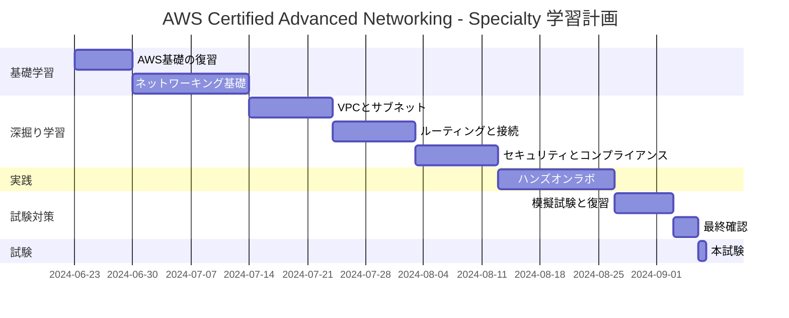

# AWS Certified Advanced Networking - Specialty 資格取得ガイド

## 1. 試験概要

| 項目 | 詳細 |
|------|------|
| 試験時間 | 170分 |
| 問題数 | 65問 |
| 形式 | 多肢選択式、複数回答式 |
| 合格ライン | 750点/1000点 |
| 対象者 | ネットワーキングの設計と実装に5年以上の経験を持つ個人 |

## 2. 出題範囲

1. ネットワーク設計 (30%)
2. ネットワーク実装 (26%)
3. ネットワーク管理とオペレーション (20%)
4. ネットワークセキュリティ (24%)

## 3. 主要な学習トピック

- Amazon VPC
- AWS Direct Connect
- AWS Transit Gateway
- AWS PrivateLink
- Elastic Load Balancing
- Amazon Route 53
- AWS Global Accelerator
- AWS WAF & Shield
- ネットワークセキュリティグループとNACL

## 4. 学習リソース

1. AWS公式ドキュメント
2. AWS公式トレーニングコース
3. サードパーティの学習教材（Udemy、A Cloud Guru など）
4. AWS ホワイトペーパー
5. ハンズオン実践（AWS Free Tier の活用）

## 5. 学習計画例

## 6. 試験対策のコツ

1. **実践重視**: 理論だけでなく、実際にAWSコンソールで設定を行ってみましょう。
2. **ネットワーク図の理解**: 複雑なネットワーク構成を図で理解する練習をしましょう。
3. **トラブルシューティング**: ネットワーク問題の診断と解決方法を学びましょう。
4. **最新情報のキャッチアップ**: AWSの新機能や更新を定期的にチェックしましょう。
5. **模擬試験の活用**: 本番の雰囲気に慣れるため、複数の模擬試験を受けましょう。

## 7. 試験当日の注意点

- 身分証明書を忘れずに
- 試験開始時間の15分前には会場に到着
- リラックスして臨むこと
- 時間配分に注意（約2.6分/問）
- 不明な問題はマークして後で見直す

がんばってください！この資格取得が、あなたのキャリアの大きな一歩となりますように。
